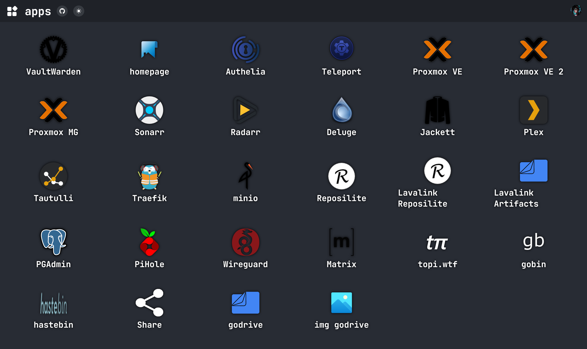

[](https://goreportcard.com/report/github.com/topi314/goboard)
[](https://golang.org/doc/devel/release.html)
[](LICENSE)
[](https://github.com/topi314/goboard/releases/latest)
[](https://github.com/topi314/goboard/actions/workflows/docker.yml)
[](https://discord.gg/sD3ABd5)

# goboard

A simple service dashboard with custom icons, names and links.
Services can be hidden depending on OIDC groups & users.



<details>
<summary>Table of Contents</summary>

- [Features](#features)
- [Installation](#installation)
  - [Docker](#docker)
    - [Docker Compose](#docker-compose)
  - [Manual](#manual)
  - [Configuration](#configuration)
  
</details>

## Features

- OIDC Authentication
- Customizable icons, names, descriptions and links
- Hide services depending on OIDC groups & users
- Dark & Light mode
- Responsive design
- Docker support
- Easy to use
- No database required

## Installation

### Docker

The easiest way to deploy goboard is using docker with [Docker Compose](https://docs.docker.com/compose/). You can find the docker image on [Packages](https://github.com/topi314/goboard/pkgs/container/goboard).

#### Docker Compose

Create a new `docker-compose.yml` file with the following content:

```yaml
version: "3.8"

services:
  goboard:
    image: ghcr.io/topi314/goboard:latest
    container_name: goboard
    restart: unless-stopped
    volumes:
      - ./goboard.yml:/var/lib/goboard/goboard.yml:ro
      - ./icons/:/var/lib/goboard/icons/:ro
    ports:
      - 80:80
```

For `goboard.yml` see [Configuration](#configuration).

```bash
docker-compose up -d
```

---

### Manual


#### Requirements

- Go 1.20 or higher

#### Build

```bash
git clone https://github.com/topi314/goboard.git
cd goboard
go build -o goboard
```

or

```bash
go install github.com/topi314/goboard@latest
```

#### Run

```bash
goboard --config=goboard.yml
```

---

## Configuration

Create a new `goboard.yml` file with the following content:


```yml
  log:
    # log level, either "debug", "info", "warn" or "error"
    level: info
    # log format, either "json" or "text"
    format: text
    # whether to add the source file and line to the log output
    add_source: false

  # enable or disable hot reload of templates and assets
  dev_mode: false
  # enable or disable debug profiler endpoint
  debug: false

  server:
    # on which address & port to listen
    listen_addr: 0.0.0.0:80
    # the title of the page
    title: goboard
    # the icon of the page
    icon: icon/goboard.png
    # where to find the custom icons
    icons_dir: ./icon

  # auth configuration for OIDC
  auth:
    # if the site is http or https
    secure: true
    # the OIDC issuer URL
    issuer_url: https://auth.example.com
    # the client ID
    client_id: goboard
    # the client secret
    client_secret: secret
    # the redirect URL for the OIDC callback
    redirect_url: https://example.com/callback

  # the services to display on the dashboard
  services:
      # the name of the service
    - name: example
      # the description of the service (optional)
      description: example service
      # the icon of the service (can also be a url to an external site) (optional)
      icon: icon/example.png
      # the link to the service
      link: https://example.com
      # the groups that can see the service (optional)
      groups: [ group1 ]
      # the users that can see the service (optional)
      users: [ user1 ]
}
```

---

## License

goboard is licensed under the [Apache License 2.0](/LICENSE).

---

## Contributing

Contributions are always welcome! Just open a pull request or discussion and I will take a look at it.

---

## Contact

- [Discord](https://discord.gg/sD3ABd5)
- [Twitter](https://twitter.com/topi314)
- [Email](mailto:git@topi.wtf)
